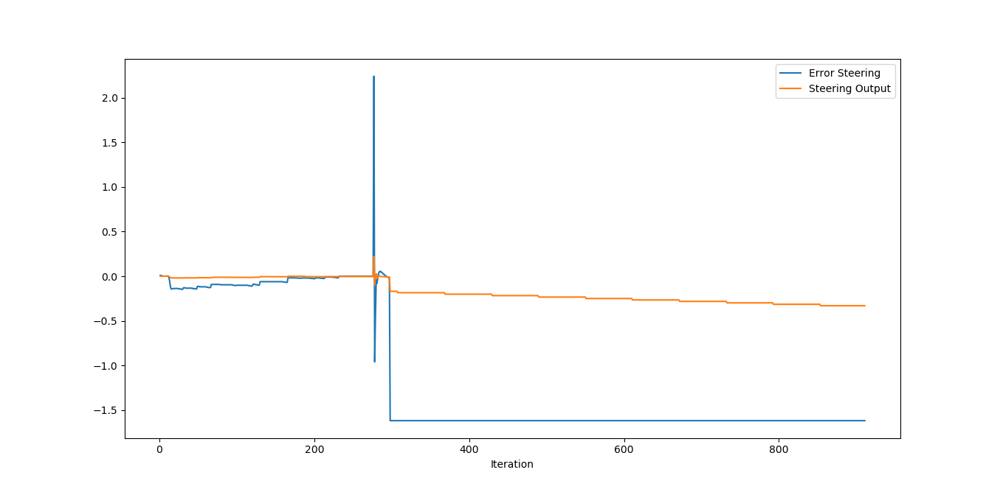
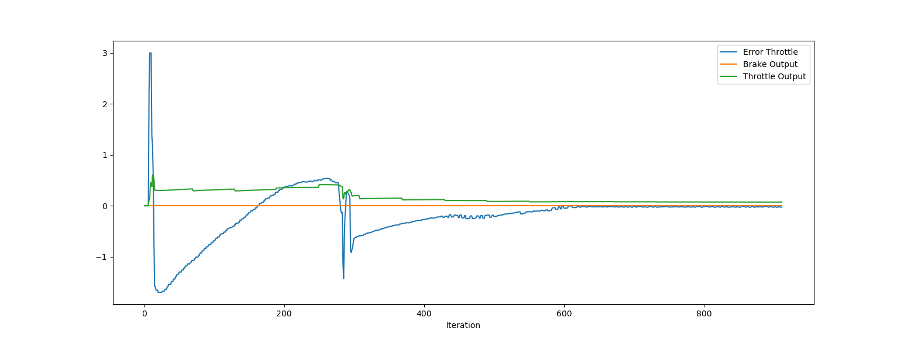

Plot for steering output and error: 

We can see that PID controller is able to reduce the error on the steering angle (0-300 s).
Steering output is not highly affected by big changes in steering error, which allows to keep smooth trajectory. This is something that we would require from self-driving car to keep the ride safe and comfortable for the passengers.

Plot for throttle output and error:

Similar as in the steering PID, the throttle one is also performing as it should and minimize the error between expected and actual velocity. Parameters of the PID are also set up in such way, to keep the smooth experience. No major jumps in throtthle output are visible.

Answers for the project questions:
* What is the effect of the PID according to the plots, how each part of the PID affects the control command?
    * PID is able to minimize the error between desired and actual velocity / yaw angle of the vehicle by producing control output. Controller parameters can be adjusted to make it behave in required way. For example we might require the that PID controller doesn't overshoot or minimizes the error in limited time. In the project the PID parameters were chosen to keep the drive smooth.
* What is the effect of the PID according to the plots, how each part of the PID affects the control command?
    * P is proportional part of the controller. It's producing control output proportional to the current difference between required and actual value of the state variable. 
    I is integral part of the controller. It's using the sum of the previous errors multiplied by constant parameter. It helps to reduce time required for minimizing the error. It's also able to remove the bias which occurs when P controller is no longer able to reduce the error.
    D is derivative part of the controller. It's responding to the rate of change of the error signal. This helps to reduce the overshooting.
* How would you design a way to automatically tune the PID parameters?
    * One way is to implement twiddle algorithm which was presented in one of the lessons. We provide initial values of the PID parameters and probing intervals. After that we can run the PID controller and analyze the quality of the control output. Then the algorithm is tweaking the parameters up and down by the probing intervals, calculates the new quality indicator and replaces the parameters if new results are better. 
* PID controller is a model free controller, i.e. it does not use a model of the car. Could you explain the pros and cons of this type of controller?
    * Pros: PID controller is relatively light-weight and can be run in real time, which makes it perfect for automotive applications. It's widely known in the industry and can be applied to many different problems, not only steering and throttle control.
    * Cons: PID controller is not able to take into account limitations of the vehicle like min/max acceleration or max steering angle rate. This has to be considered while tuning the parameters. Another problem is that PID tuned for the low speed scenario might not behave correctly for highers speed. For example the steering output might be too aggresive while driving on the highway, causing the significant risk for the passengers.
* (Optional) What would you do to improve the PID controller?
    * PID controller in this project should be further tuned to achieve better results. I would also try out scenarios with higher speed and maybe try to distinquish several ranges of speed that would use different parameters.